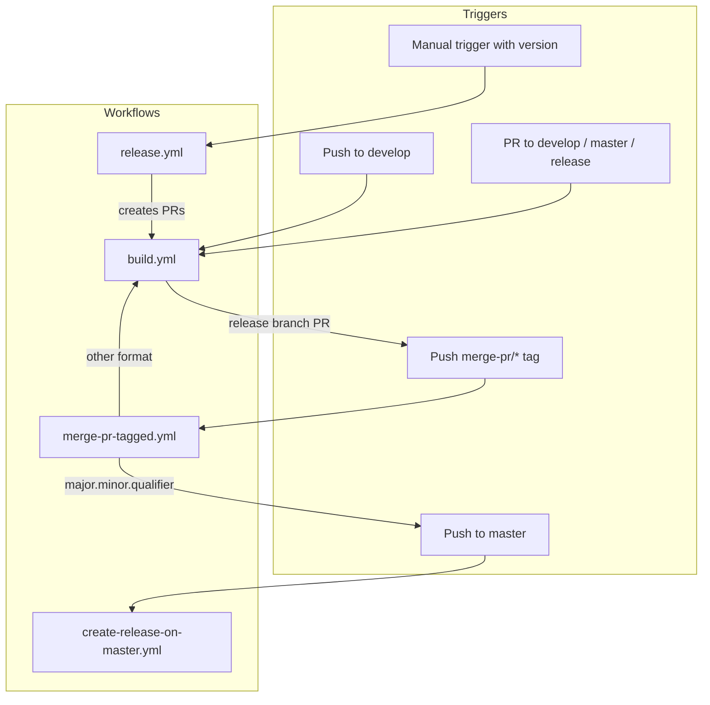
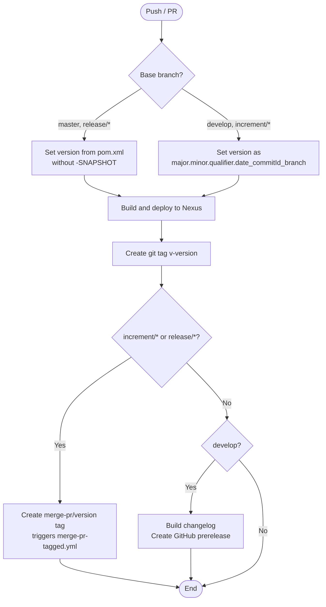
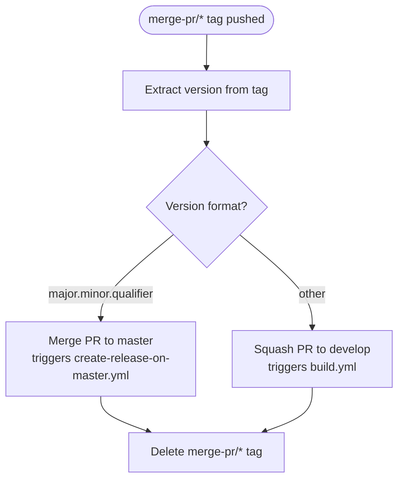
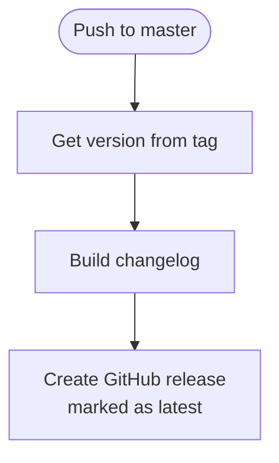
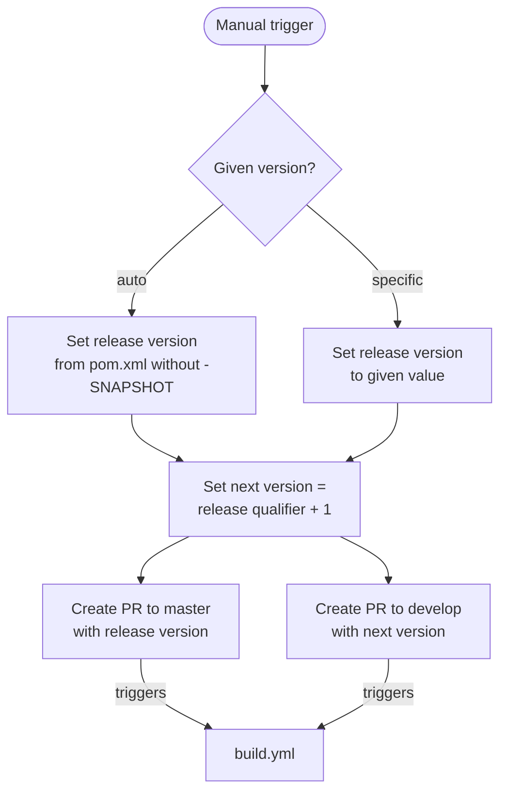

# CI/CD Flow — Development Version and Branch Handling

This document describes the branching strategy, versioning policy, and GitHub Actions CI/CD pipeline used by this project.

## Branches

The branching model is based on [GitFlow](https://www.atlassian.com/git/tutorials/comparing-workflows/gitflow-workflow):

| Branch Pattern | Purpose |
|---------------|---------|
| `develop` | Main development branch; contains latest development sources |
| `feature/JNG-NUMBER_short_summary` | Feature branches based on `develop`; merged back when complete |
| `release/X.Y.Z` or `X_Y_Z` | Release branches cut from `develop` for stabilization |
| `bugfix/JNG-NUMBER_short_summary` | Bug fixes applied to release branches, then merged forward |
| `support/JNG-NUMBER_short_summary` | Minor changes to previous releases; merged back to release branch |
| `hotfix/JNG-NUMBER_short_summary` | Critical fixes applied to both `master` and release branches |
| `master` | Latest released sources |

### Branch Flow

```mermaid
gitGraph
    commit id: "init"
    branch develop
    commit id: "dev-1"
    branch feature/JNG-1
    commit id: "feat-1"
    commit id: "feat-2"
    checkout develop
    merge feature/JNG-1 id: "merge-feat"
    branch release/1.0-beta1
    commit id: "rc-1"
    branch bugfix/JNG-4
    commit id: "fix-1"
    checkout release/1.0-beta1
    merge bugfix/JNG-4 id: "merge-fix"
    checkout develop
    merge release/1.0-beta1 id: "merge-release"
    checkout master
    merge release/1.0-beta1 id: "release-1.0"
```

## Version Numbers

Versions follow semantic versioning with these rules:

| Event | Version Change |
|-------|---------------|
| Start a `feature/` branch | No change (inherits from `develop`) |
| Cut a `release/` branch from `develop` | 2nd number incremented on `develop` |
| Start a `bugfix/` branch | No change (applied to release branch before merge to `master`) |
| Start a `support/` branch | 3rd number incremented |
| Start a `hotfix/` branch | 4th number incremented |

## GitHub Actions Workflows

The CI/CD pipeline consists of four interconnected workflows:

### Overview



### build.yml

Triggered on pushes to `develop` or pull requests to `develop`, `master`, `increment/*`, or `release/*` branches.



### merge-pr-tagged.yml

Triggered when a `merge-pr/*` tag is pushed.



### create-release-on-master.yml

Triggered on pushes to `master`.



### release.yml

Triggered manually with a version parameter (`auto` or `major.minor.qualifier`).



## Development Rules

> **Important:** There is no commit without a ticket number. Every pull request and commit must reference a JIRA ticket (e.g., `JNG-xxx`).

Issue tracking: [JIRA Dashboard](https://blackbelt.atlassian.net/jira/dashboards)
