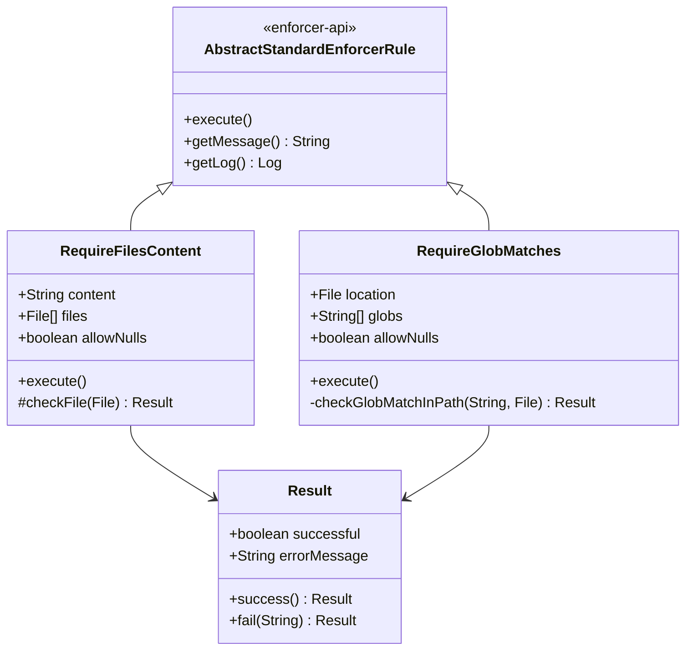
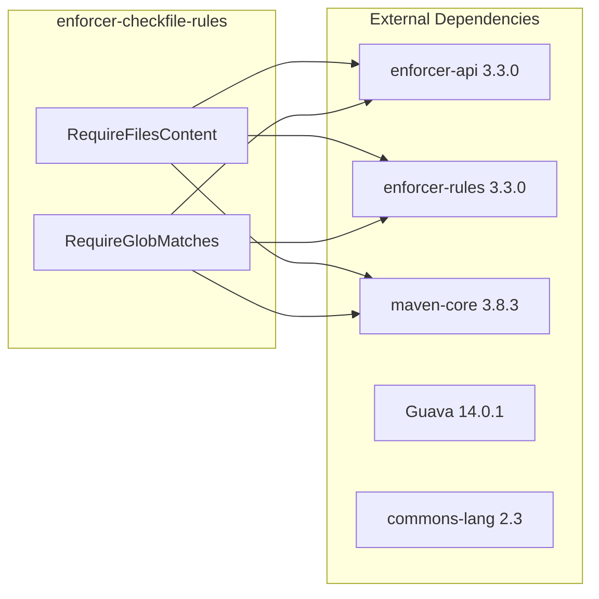

# Enforcer Checkfile Rules

Additional custom rules for the [Maven Enforcer Plugin](https://maven.apache.org/enforcer/maven-enforcer-plugin/). This library provides rules that go beyond the standard enforcer rule set, allowing Maven builds to validate file contents and glob-based file existence.

## Available Rules

| Rule | Description |
|------|-------------|
| `requireFilesContent` | Verifies that specified files exist and contain a given string (line-by-line `contains()` check) |
| `requireGlobMatches` | Verifies that specified glob patterns match at least one file under a given root location |

Both rules extend `AbstractStandardEnforcerRule` from the Maven Enforcer API and are discovered automatically through the `org.apache.maven.plugins.enforcer` package convention (no explicit `implementation` attribute needed in plugin configuration).

## Architecture





## requireFilesContent

Enforces that every file in a specified list exists and contains a given string. The rule reads each file line by line and checks `line.contains(content)`.

**Parameters:**

| Parameter | Required | Default | Description |
|-----------|----------|---------|-------------|
| `message` | No | (generic) | Custom error message shown when the rule fails |
| `files` | Yes | - | List of `<file>` entries pointing to files to check |
| `content` | Yes | - | The string that must appear in each file |
| `allowNulls` | No | `false` | If `true`, null file entries are treated as passing |

**Example configuration:**

```xml
<project>
  <build>
    <plugins>
      <plugin>
        <groupId>org.apache.maven.plugins</groupId>
        <artifactId>maven-enforcer-plugin</artifactId>
        <version>3.3.0</version>
        <executions>
          <execution>
            <id>enforce</id>
            <goals><goal>enforce</goal></goals>
            <configuration>
              <rules>
                <requireFilesContent>
                  <files>
                    <file>src/foo/bar</file>
                    <file>src/foo/baz</file>
                  </files>
                  <content>AutoUpdate:true</content>
                </requireFilesContent>
              </rules>
            </configuration>
          </execution>
        </executions>
        <dependencies>
          <dependency>
            <groupId>org.apache.maven.enforcer</groupId>
            <artifactId>enforcer-rules</artifactId>
            <version>3.3.0</version>
          </dependency>
          <dependency>
            <groupId>hu.blackbelt.maven.plugin</groupId>
            <artifactId>enforcer-checkfile-rules</artifactId>
            <version>VERSION</version>
          </dependency>
        </dependencies>
      </plugin>
    </plugins>
  </build>
</project>
```

## requireGlobMatches

Enforces that each specified glob pattern matches at least one file under the given root location. Uses Java's `PathMatcher` with the `glob:` syntax and walks the file tree from the `location` directory.

**Parameters:**

| Parameter | Required | Default | Description |
|-----------|----------|---------|-------------|
| `message` | No | (generic) | Custom error message shown when the rule fails |
| `globs` | Yes | - | List of `<glob>` patterns to check |
| `location` | Yes | - | Root directory from which globs are resolved (paths are relativized to this) |

**Example configuration:**

```xml
<project>
  <build>
    <plugins>
      <plugin>
        <groupId>org.apache.maven.plugins</groupId>
        <artifactId>maven-enforcer-plugin</artifactId>
        <version>3.3.0</version>
        <executions>
          <execution>
            <id>enforce</id>
            <goals><goal>enforce</goal></goals>
            <configuration>
              <rules>
                <requireGlobMatches>
                  <globs>
                    <glob>src/foo/b*</glob>
                  </globs>
                  <location>${project.basedir}</location>
                </requireGlobMatches>
              </rules>
            </configuration>
          </execution>
        </executions>
        <dependencies>
          <dependency>
            <groupId>org.apache.maven.enforcer</groupId>
            <artifactId>enforcer-rules</artifactId>
            <version>3.3.0</version>
          </dependency>
          <dependency>
            <groupId>hu.blackbelt.maven.plugin</groupId>
            <artifactId>enforcer-checkfile-rules</artifactId>
            <version>VERSION</version>
          </dependency>
        </dependencies>
      </plugin>
    </plugins>
  </build>
</project>
```

## Integration Tests

Sample usage scenarios live in `src/it/` and are executed via `maven-invoker-plugin`. Each subdirectory is a self-contained Maven project that exercises one rule:

| Scenario | Expected Result |
|----------|-----------------|
| `RequireFilesContent/content-found` | BUILD SUCCESS |
| `RequireFilesContent/content-not-found` | BUILD FAILURE |
| `RequireFilesContent/content-not-specified` | BUILD FAILURE |
| `RequireFilesContent/file-not-exist` | BUILD FAILURE |
| `RequireGlobMatches/glob-matches` | BUILD SUCCESS |
| `RequireGlobMatches/glob-not-matches` | BUILD FAILURE |

## Contributing

See [CONTRIBUTING.md](CONTRIBUTING.md) for guidelines on submitting issues and pull requests.

## License

This project is licensed under the [Apache License 2.0](http://www.apache.org/licenses/LICENSE-2.0.txt).
